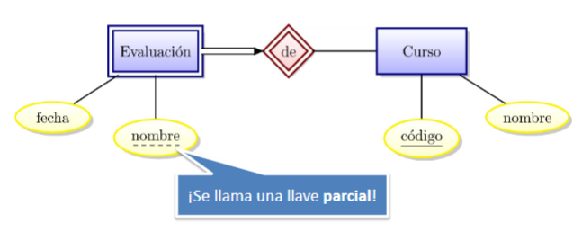

Es un modelo de datos semanticos usado para el diseño inicial y de alto nivel de una [[Base de datos]]. Describe que se está representando a traves de sus 3 elementos principales:
- Entidades
- Atributos
- Relaciones

# Entidades
Objetos que se representan por rectángulos.
## Entidad débil 
Sus atributos no contiene una llave primaria por si solos (no pueden identificarse solamente con sus atributos. Dependen de la **llave primaria** de otra entidad (entidad propietaria o identificadora) para identificarse correctamente.

- **Llave parcial (discriminante):** Conjunto de atributos propios que identifican a la entidad débil.

Para que se considere débil debe cumplir que:
#### Cadena de entidades débiles

1. **Relación Indentificadora:** la E. propietario y la E. débil deben asociarse de 1 a N (un propietario puede tener va rias  E.débiles pero una E. débil solo tiene un dueño).
2. **Participación Total:** La entidad débil debe tener una participación total en la relación. 
- **Atributos (propiedades):** Se representan por óvalos conectados a la entidad o relación.
- *Llave primaria:* No pueden identificarse de forma unica mediante sus propias propiedades, aparece subrayado dentro del ovalo

# Relaciones
Representada por rombos. Permiten modelar los requerimientos de una base de datos de manera menos técnica (tablas, documentacion).

R. de Agregación: permite indicar que una relación previa participa en una nueva asociación, tratandola como entidad para propositos de definición, crea una **entidad virtual** encapsulando una relación. Representación: recuadro de linea discontinua que encierra a la relación original y sus entidades participantes

proposito→ expresar relacion entre relaciones 

                                                             R. Binarias: cuando la asociacion involucra a dos conjuntos de entidades, tienen atributos y multiplicidad.

R. Ternaria: cuando se involucra simultaneamente a tres conjuntos de entidades.  

representación→ unico rombo conectado a tres rectangulos (entidades)

R. Recursiva (relación de roles): cuando un mismo conjunto de entidades participa má de una vez en un conjunto de relaciones, en vez de conectar 2 entidades distintas la relacion se asocia consigo misma

Indicador de Rol: nombres de roles en las lineas que conectan la entidad con la relacion

Representacion→Se dibuja un **rombo** (la relación) conectado por **dos líneas distintas al mismo rectángulo** (la entidad)
Cada línea (arco) debe estar etiquetada con el nombre del **rol** que desempeña la entidad en esa dirección específica de la relación

**¿Por qué diferenciar una ternaria de varias binarias?**

no siempre se puede descomponer una r. ternaria en binaria sin perder significado real 

### Relaciones según Multiplicidad ( Restriccion de LLave)

Cuantas instancias de una entidad pueden asociarse con instancias de otro entidad  por medio de una relación. Tres tipos: 

ojo: n significa “cero o más”

- Muchos a muchos (n a n)
    
    ejm: empleados y departamentos, un empleado puede trabajar en varios departamentes y un departamento puede tener varios empleados
    
- Uno a muchos (1 a n):
    
    ejm: una entidad (departamento) puede relacionarse a lo mucho con una instancia de otra entidad (Gerente) pero este puede supervisar muchos departamentos
    
    
    
- Uno a uno (1 a 1):
    
    Cuando cada entidad en ambos conjuntos solo puede estar asociada como maximo a una instancia de otra entidad
    

#### Relaciones Binarias

Asocian 2 conjuntos 

#### Restricciones de Participación

Determinan si la existencia de una entidad depende de como se asocia a otra entidad mediante relaciones.

- **Participación Total:** cuando cada entidad de un conjunto tiene que estar conectada con almenos una relacion.
    - Representación: linea gruesa o linea doble
    
    
    

                 **“cada profesor trabaja en almenos una uni”**

- **Participacion Parcial:** no todas las entidades de un conjunto participan en la relación. EJM: empleados, departamentos y la relación dirige, ya que no todos los empleados dirigen un departamento.
    - Representación: linea simple

#### Notacion de Cardinalidad

- min: indica el minimo de participaciones
    - 0 → participacion parcial
    - 1 → participacion total
- max: máximo de participaciones (1 o N para multiplicidad)
    - Ejm: ( 1 , 1 ) → participa de manera total y tiene restriccion de multiplicidad de maximo 1
    - ( 0 , N )→ participacion parcial y multiplicidad de “muchos”
    - ejm **“cada profesor trabaja en una sola universidad” —>**
    
    
    

#### Solapamiento (OVERLAP)

Restriccion que determina si una entidad pertenezca a dos o más subclases simultaneamente.}

¿se permite que 2 subclases contengan la misma instancia de una entidad?

- Sin solapamiento:  2 subclases son disjuntivas, la interseccion de sus conjuntos  de entidades son  vacios.
    - EJM: vino y cervesa dentro de una superclase bebida, donde una bebida no puede ser las 2 subclases a la vez.
        
        
        
- Con solapamiento: una entidad aparece en multiples subclases

#### Jerarquias de clases (ISA/ is a)

Sirve para clasificar entidades en subgrupos con caracteristicas especificas, **se representa**: triangulo con “IsA” para conectar una superclase ccon sus subclases

<aside>
💡

La superclase se ubica en la parte superior del triangulo y las subclases se conectan a la base.

</aside>

- Las subclases heredan todos los atributos de la superclase automaticamente
- cada subclase puede tener sus propios atributos adicionales

Restricciones Asociadas:

Para que la representacion sea completa, se deben definir  2 restricciones

- Overlaping
- Covertura/Covering: si todas las entidades de la superclase deben pertenecer a alguna subclase, si no se puede afirmes que **todas** pertenecen a una subclase no hay cobertura total.