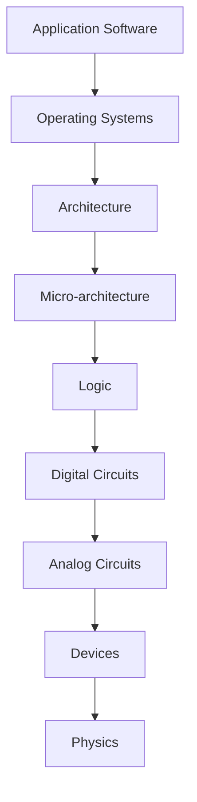

Computer systems are typically designed using multiple levels of abstraction. Each level hides the details of the level below it, allowing designers to manage complexity.

```mermaid
graph TD
    Software[Application Software] --> OS[Operating Systems]
    OS --> Arch[Architecture]
    Arch --> Micro[Micro-architecture]
    Micro --> Log[Logic]
    Log --> Dig[Digital Circuits]
    Dig --> Analog[Analog Circuits]
    Analog --> Dev[Devices]
    Dev --> Phys[Physics]
```

